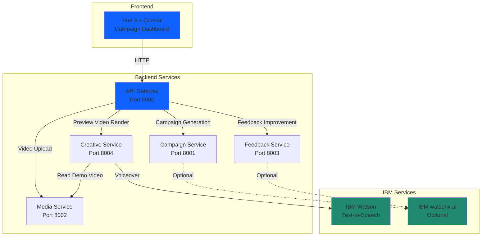

# KadriX

**Developer-focused launch workflow platform for the IBM Bob Dev Day Hackathon**

KadriX helps developers, indie hackers, hackathon teams, and technical founders turn MVP demos or technical walkthroughs into launch-ready product messaging, storyboards, voiceover scripts, and generated preview assets faster.

---

## Hackathon Alignment

**IBM Bob Dev Day Hackathon**  
**Theme:** "Turn idea into impact faster with IBM Bob"

KadriX addresses a critical post-build challenge: developers can build MVPs quickly, but transforming technical demos into launch-ready marketing assets (messaging, campaign angle, storyboard, preview video, voiceover) is slow and unfamiliar work. KadriX accelerates this workflow by generating structured launch assets from product details and demo footage, helping software builders move from working prototype to launch-ready presentation faster.

---

## Problem Statement

Many developers, indie hackers, and hackathon teams already have a working MVP, prototype, or technical demo. The harder part starts when they need to turn that technical achievement into clear product messaging for launch.

**Post-build launch work is slow:**
- Defining product messaging and value proposition
- Identifying the right campaign angle and target audience
- Creating marketing hooks and ad copy variants
- Developing a storyboard for a launch video
- Writing voiceover scripts
- Generating preview video assets
- Iterating based on feedback

For solo developers, indie hackers, hackathon teams, and small startup teams, this process is often slow, unfamiliar, and expensive.

---

## Solution

KadriX provides a structured workflow that transforms technical demos into launch-ready output:

1. **User enters product/MVP details** (product idea, description, campaign goal, target audience, tone)
2. **User uploads demo video or technical walkthrough** (optional)
3. **KadriX generates comprehensive launch assets:**
   - Product summary and target audience analysis
   - Campaign angle and value proposition
   - Marketing hooks (4 variants)
   - Ad copy variants (LinkedIn, Instagram, YouTube Shorts)
   - Call to action
   - Video Ad Blueprint with storyboard (6 scenes with timestamps, visual direction, narration)
   - Voiceover script with mood/music/visual direction
   - One-minute video plan
4. **KadriX generates preview launch video** using uploaded demo footage when available
5. **IBM Watson Text-to-Speech generates voiceover** (when credentials configured)
6. **User provides feedback** to improve the campaign
7. **KadriX generates improved version** with side-by-side comparison

---

## Key Features

**Implemented in this hackathon proof of concept:**

- ✅ Product/MVP input form with structured fields
- ✅ Demo video upload (up to 200MB)
- ✅ Campaign generation with comprehensive Video Ad Blueprint
- ✅ Storyboard with 6 timestamped scenes (visual direction + narration)
- ✅ Voiceover script with tone-specific direction
- ✅ Marketing hooks and ad copy variants for multiple platforms
- ✅ Preview video generation from uploaded demo footage
- ✅ Fallback to text slide generation when no demo video available
- ✅ IBM Watson Text-to-Speech voiceover integration (optional)
- ✅ Multiple voice actor options (Michael, Allison, Lisa, Henry, Kevin, Olivia)
- ✅ Feedback improvement flow with version comparison
- ✅ Optional IBM watsonx.ai integration for campaign generation (with template fallback)
- ✅ Microservice architecture with Docker Compose
- ✅ Documented Bob IDE development sessions in `/bob_sessions`

---

## Architecture

KadriX is structured as a microservice-oriented monorepo with a Vue 3 frontend and Python FastAPI backend services.



### Service Responsibilities

**Frontend (Quasar + Vue 3 + TypeScript + Vite)**
- Campaign workflow dashboard with structured workspace
- Product brief form with validation
- Demo video upload UI
- Campaign preview with expandable sections
- Video Ad Blueprint display
- Preview video player
- Feedback input with quick suggestions
- Version comparison with side-by-side layout

**API Gateway (FastAPI)**
- Central entry point for all frontend requests
- Routes requests to internal services
- Handles CORS for local development
- Proxies video assets with HTTP Range support for seeking

**Campaign Service (FastAPI)**
- Processes product brief and optional video context
- Generates comprehensive campaign blueprint
- Creates Video Ad Blueprint with storyboard
- Optional IBM watsonx.ai integration with template fallback
- Returns structured campaign data (product summary, hooks, ad copy, storyboard, voiceover script)

**Media Service (FastAPI)**
- Accepts uploaded video files (up to 200MB)
- Stores video files to persistent volume
- Returns mock transcript and product context (Speech-to-Text is roadmap)
- Serves uploaded videos with HTTP Range support

**Feedback Service (FastAPI)**
- Accepts original campaign and user feedback
- Generates improved campaign version
- Optional IBM watsonx.ai integration with template fallback
- Returns version comparison data

**Creative Service (FastAPI)**
- Generates preview launch videos from campaign blueprints
- Uses uploaded demo footage when available (source_video mode)
- Falls back to text slides when no demo video (fallback_slides mode)
- Integrates IBM Watson Text-to-Speech for voiceover
- Supports multiple voice actors
- Outputs MP4 videos with audio

---

## Technology Stack

**Frontend:**
- Quasar Framework 2.x
- Vue 3 with Composition API
- TypeScript
- Vite
- Axios

**Backend:**
- Python 3.11+
- FastAPI
- Pydantic for data validation
- httpx for service-to-service communication

**Infrastructure:**
- Docker & Docker Compose
- Persistent volumes for media and video storage

**Video Processing:**
- MoviePy for video editing and composition
- Pillow (PIL) for image generation
- FFmpeg (via MoviePy)

**IBM Services:**
- **IBM Bob IDE** - Primary development partner (used throughout project)
- **IBM Watson Text-to-Speech** - Voiceover generation (optional, configured via .env)
- **IBM watsonx.ai** - Campaign generation and feedback improvement (optional, configured via .env)

---

## IBM Bob Usage

**KadriX was built using IBM Bob IDE as the primary documented development partner.**

IBM Bob was used through the **Bob IDE** as an interactive development assistant throughout the entire project lifecycle. Bob helped accelerate development by providing:

- Architecture planning and microservice design
- Backend service implementation (FastAPI, Docker)
- Frontend workflow development (Quasar, Vue 3)
- Creative service video generation logic
- IBM Watson Text-to-Speech integration
- Docker Compose orchestration
- Debugging and technical review
- Code quality improvements
- Documentation and README updates
- Final hackathon submission preparation

**Important:** IBM Bob was used through the **Bob IDE** as an interactive development partner, not called programmatically through a REST API. KadriX does not make runtime API calls to IBM Bob.

### Bob Session Evidence

Exported IBM Bob task session reports and consumption summary screenshots are stored in:

```
bob_sessions/
├── 01_architecture_plan.md
├── 02_backend_microservices_docker.md
├── 03_quasar_frontend_core_flow.md
├── 04_campaign_video_blueprint_review.md
├── 05_creative_service_preview_video_generation.md
├── 06_architecture_diagram_and_next_steps.md
├── 07_updated_readMe_and_project_idea.md
├── 08_creative_service_render_fix.md
├── 09_demo_clip_remix_and_voiceover_video.md
├── 10_ad_style_video_renderer_fix.md
├── 11_ibm_tts_voiceover_integration.md
└── [screenshots for each session]
```

---

## Optional IBM Runtime Services

### IBM Watson Text-to-Speech (Implemented)

**Status:** ✅ Implemented and working when credentials are configured

KadriX uses IBM Watson Text-to-Speech to generate voiceover audio for preview videos. The creative-service integrates with IBM TTS to convert the campaign voiceover script into spoken narration.

**Features:**
- Multiple voice actor options (Michael, Allison, Lisa, Henry, Kevin, Olivia)
- Automatic script cleaning and duration fitting
- MP3 audio generation
- Audio attachment to generated MP4 videos
- Graceful fallback to silent video if TTS fails

**Configuration:** Set `USE_IBM_TTS=true` and provide IBM TTS credentials in `.env`

### IBM watsonx.ai (Implemented)

**Status:** ✅ Implemented with template fallback for demo stability

KadriX can optionally use IBM watsonx.ai (Granite models) for campaign generation and feedback improvement. When configured, the campaign-service and feedback-service use watsonx.ai to generate more dynamic and contextual campaign content.

**Features:**
- Campaign blueprint generation using Granite models
- Feedback-based campaign improvement
- Automatic fallback to deterministic templates if watsonx.ai is unavailable or fails
- Ensures demo stability regardless of API availability

**Configuration:** Set `USE_WATSONX=true` and provide watsonx.ai credentials in `.env`

### IBM Speech-to-Text (Roadmap)

**Status:** 🔄 Planned future enhancement

Currently, the media-service returns mock transcripts for uploaded demo videos. Future integration with IBM Speech-to-Text would enable:
- Automatic video transcription
- Product context extraction from narration
- Multi-language support

---

## Setup Instructions

### Prerequisites

- Docker and Docker Compose
- Node.js 18+ and npm (for frontend development)

### Backend Setup

1. **Clone the repository**
   ```bash
   git clone <repository-url>
   cd KadriX
   ```

2. **Configure environment variables**
   ```bash
   cp .env.example .env
   ```
   
   Edit `.env` and configure optional IBM services:
   - For IBM Watson TTS: Set `USE_IBM_TTS=true` and add your credentials
   - For IBM watsonx.ai: Set `USE_WATSONX=true` and add your credentials
   
   **⚠️ IMPORTANT:** Never commit `.env` with real credentials. Keep it local only.

3. **Build and start backend services**
   ```bash
   docker compose build
   docker compose up -d
   ```

4. **Verify services are running**
   ```bash
   docker compose ps
   ```
   
   All services should show as "Up":
   - api-gateway (port 8000)
   - campaign-service (port 8001)
   - media-service (port 8002)
   - feedback-service (port 8003)
   - creative-service (port 8004)

### Frontend Setup

1. **Navigate to frontend directory**
   ```bash
   cd frontend
   ```

2. **Install dependencies**
   ```bash
   npm install
   ```

3. **Start development server**
   ```bash
   npm run dev
   ```

4. **Open browser**
   ```
   http://localhost:5173
   ```

---

## Environment Variables

Configure these in your `.env` file (copy from `.env.example`):

### Service URLs (Docker internal)
```bash
CAMPAIGN_SERVICE_URL=http://campaign-service:8001
MEDIA_SERVICE_URL=http://media-service:8002
FEEDBACK_SERVICE_URL=http://feedback-service:8003
CREATIVE_SERVICE_URL=http://creative-service:8004
```

### IBM Watson Text-to-Speech (Optional)
```bash
USE_IBM_TTS=false
IBM_TTS_API_KEY=your_api_key_here
IBM_TTS_URL=your_service_url_here
IBM_TTS_VOICE=en-US_MichaelV3Voice
```

### IBM watsonx.ai (Optional)
```bash
USE_WATSONX=false
WATSONX_API_KEY=your_api_key_here
WATSONX_PROJECT_ID=your_project_id_here
WATSONX_URL=https://us-south.ml.cloud.ibm.com
WATSONX_MODEL_ID=ibm/granite-4-h-small
```

**⚠️ SECURITY:** Real API keys and credentials must stay in your local `.env` file and must never be committed to version control. The `.gitignore` file is configured to exclude `.env`.

---

## Demo Flow

**Recommended 3-minute demo flow:**

1. **Open KadriX Campaign Dashboard** (`http://localhost:5173`)

2. **Load sample product details** (or use LaunchBoard as example):
   - Product Idea: "LaunchBoard"
   - Description: "A developer-focused launch workflow platform that helps indie hackers turn MVP demos into launch-ready marketing campaigns"
   - Campaign Goal: "Drive early adopter signups"
   - Target Audience: "Indie hackers and solo developers"
   - Tone: "Professional"
   - TTS Voice: "Michael (US Male)"

3. **Upload demo video** (LaunchBoard demo or any product walkthrough)

4. **Generate campaign** - Show the comprehensive Video Ad Blueprint:
   - Product summary and target audience
   - Campaign angle and value proposition
   - Marketing hooks (4 variants)
   - Ad copy variants (LinkedIn, Instagram, YouTube Shorts)
   - Storyboard with 6 timestamped scenes
   - Voiceover script with mood/music/visual direction

5. **Generate preview video** - Show the video generation process:
   - Uses uploaded demo footage
   - Adds overlays and text
   - Generates IBM Watson TTS voiceover
   - Creates 45-60 second launch preview

6. **Play generated preview** - Demonstrate the final output with voiceover

7. **Improve campaign with feedback** - Enter feedback like:
   - "Make it more casual and friendly"
   - "Focus on younger developers"
   - "Add more urgency to the call-to-action"

8. **Show version comparison** - Display side-by-side original vs improved

9. **Show Bob sessions** - Briefly show `/bob_sessions` folder with exported task histories

---

## Hackathon Deliverables

### Required Submissions

1. **Demo Video URL**
   - [ ] TODO: Add final demo video URL here after recording

2. **Problem and Solution Statement**
   - ✅ Documented in this README (see Problem Statement and Solution sections)

3. **IBM Bob Usage Statement**
   - ✅ Documented in this README (see IBM Bob Usage section)
   - ✅ Exported Bob sessions in `/bob_sessions` folder

4. **Public Repository URL**
   - [ ] TODO: Add public repository URL here

5. **Bob Session Evidence**
   - ✅ 11 exported Bob session markdown files in `/bob_sessions`
   - ✅ Screenshots for each session showing task consumption

---

## Current Limitations / Roadmap

**This is a hackathon proof of concept.** The following limitations and future enhancements are acknowledged:

### Current Limitations

- Generated preview video is a launch preview asset, not a final production advertisement
- Mock transcripts used instead of real Speech-to-Text (IBM STT is roadmap)
- No user authentication or multi-user support
- No persistent database (campaigns are session-based)
- No social media publishing integrations
- No analytics or campaign performance tracking
- Video editing capabilities are basic (overlays and composition)

### Future Enhancements

- **IBM Speech-to-Text integration** for automatic demo video transcription
- **Deeper watsonx.ai orchestration** for campaign scoring, variant generation, and brand voice profiles
- **Social media publishing** (LinkedIn, Instagram, YouTube, TikTok)
- **Campaign analytics** and performance tracking
- **Advanced video editing** with transitions, effects, and professional templates
- **Brand voice profiles** for consistent messaging across campaigns
- **PDF export** for campaign blueprints
- **User authentication** and team collaboration
- **Campaign versioning** and history
- **A/B testing** for campaign variants

---

## Project Structure

```
KadriX/
├── frontend/                 # Vue 3 + Quasar frontend
│   ├── src/
│   │   ├── pages/           # Campaign Dashboard, Home
│   │   ├── services/        # API client
│   │   └── router/          # Vue Router config
│   └── package.json
├── services/
│   ├── api-gateway/         # FastAPI gateway (port 8000)
│   ├── campaign-service/    # Campaign generation (port 8001)
│   ├── media-service/       # Video upload (port 8002)
│   ├── feedback-service/    # Campaign improvement (port 8003)
│   └── creative-service/    # Video generation (port 8004)
├── bob_sessions/            # Exported Bob IDE task histories
├── docs/                    # Architecture and implementation docs
├── docker-compose.yml       # Service orchestration
├── .env.example            # Environment variable template
└── README.md               # This file
```

---

## License

This project is a hackathon proof of concept built for the IBM Bob Dev Day Hackathon. License details may be added later.

---

## Acknowledgments

Built with IBM Bob IDE for the IBM Bob Dev Day Hackathon.