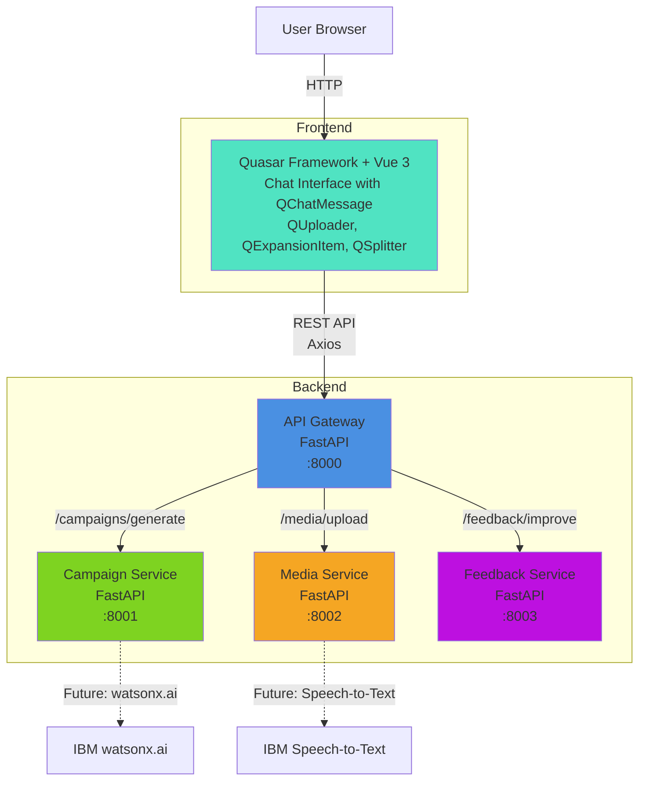
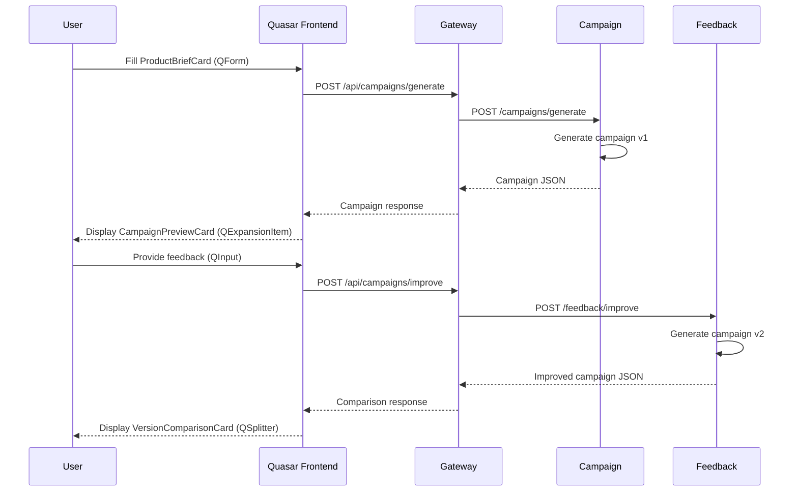

# KadriX Architecture Plan
**IBM Bob Dev Day Hackathon - Session 01_architecture_plan**

---

## 1. Exact Service Responsibilities

### Frontend (Quasar Framework + Vue 3)
**Core Purpose:** User-facing WhatsApp-style campaign workflow interface

**Exact Responsibilities:**
- Render chat-style conversation UI with message bubbles
- Handle product brief form input (idea, description, goal, audience, tone)
- Manage demo-video upload flow with drag-and-drop
- Display campaign preview cards with expandable sections
- Collect and submit user feedback via chat input
- Show side-by-side version comparison (v1 vs v2)
- Handle loading states and error messages
- Store conversation state in browser (no backend persistence needed for MVP)

**Quasar Layout Structure:**
```
QLayout (view="hHh lpR fFf")
├── QHeader (elevated)
│   └── QToolbar
│       ├── QToolbarTitle: "KadriX Campaign Assistant"
│       └── QBtn (icon, info about Bob usage)
├── QPageContainer
│   └── QPage (chat-style layout)
│       ├── QScrollArea (messages container)
│       │   ├── QChatMessage (user messages)
│       │   ├── QChatMessage (assistant messages)
│       │   ├── ProductBriefCard (QCard with QForm)
│       │   ├── CampaignPreviewCard (QCard with QExpansionItem)
│       │   └── VersionComparisonCard (QSplitter with 2 QCards)
│       └── QFooter (input area)
│           └── QInput (chat input) + QBtn (send)
```

**Key Pages:**
- `pages/IndexPage.vue` - Main chat interface (single page app)

**Key Components:**
- `components/ChatMessage.vue` - Wrapper around QChatMessage
- `components/ProductBriefCard.vue` - QCard with QForm for product input
- `components/VideoUploadCard.vue` - QCard with QUploader
- `components/CampaignPreviewCard.vue` - QCard with QExpansionItem sections
- `components/FeedbackInputCard.vue` - QCard with QInput for feedback
- `components/VersionComparisonCard.vue` - QSplitter with side-by-side QCards
- `components/LoadingMessage.vue` - QChatMessage with QSpinner

**Quasar Components Used:**

**For Chat Interface:**
- `QLayout` - Main app layout structure
- `QHeader` / `QToolbar` - Top navigation bar
- `QPage` / `QPageContainer` - Page wrapper
- `QScrollArea` - Scrollable chat messages area
- `QChatMessage` - WhatsApp-style message bubbles (built-in!)
- `QFooter` - Fixed bottom input area
- `QInput` - Chat text input with rounded style
- `QBtn` - Send button, action buttons

**For Product Brief Form:**
- `QCard` - Container for form
- `QCardSection` - Form sections
- `QForm` - Form validation wrapper
- `QInput` - Text inputs (idea, description, audience)
- `QSelect` - Dropdowns (campaign goal, tone)
- `QTextarea` - Multi-line description
- `QBtn` - Submit button

**For Campaign Preview:**
- `QCard` - Campaign container
- `QExpansionItem` - Collapsible sections (hooks, ad copy, script)
- `QSeparator` - Visual dividers
- `QChip` - Tags for audience, tone
- `QBadge` - Version indicator (v1, v2)
- `QIcon` - Section icons

**For Video Upload:**
- `QCard` - Upload container
- `QUploader` - Drag-and-drop file upload (built-in!)
- `QLinearProgress` - Upload progress bar
- `QSpinner` - Processing indicator
- `QBanner` - Success/error messages

**For Version Comparison:**
- `QSplitter` - Side-by-side layout (resizable!)
- `QCard` - Each version container
- `QTabs` / `QTabPanels` - Alternative: tabbed view
- `QChip` - "Changed" indicators
- `QTooltip` - Hover explanations

**For Loading States:**
- `QSpinner` - Loading indicators
- `QInnerLoading` - Overlay loading
- `QSkeleton` - Content placeholders
- `QLinearProgress` - Top progress bar

**For Notifications:**
- `QNotify` (plugin) - Toast notifications
- `QBanner` - Inline messages
- `QDialog` - Error dialogs

---

### API Gateway (Python + FastAPI)
**Core Purpose:** Single entry point for frontend, request routing, response normalization

**Exact Responsibilities:**
- Accept all frontend HTTP requests
- Route requests to appropriate internal services
- Aggregate responses from multiple services if needed
- Handle CORS for local development
- Normalize error responses to consistent format
- Add request/response logging
- Return unified JSON responses

**NOT Responsible For:**
- Business logic (delegate to services)
- Data persistence (stateless for MVP)
- Authentication (out of scope for MVP)

---

### Campaign Service (Python + FastAPI)
**Core Purpose:** Generate initial campaign package from product input

**Exact Responsibilities:**
- Parse product brief (idea, description, goal, audience, tone)
- Parse optional video transcript/context
- Generate structured campaign output:
  - Product summary (2-3 sentences)
  - Target audience profile (demographics + psychographics)
  - Campaign angle (strategic positioning)
  - Key value proposition (single sentence)
  - Marketing hooks (3-5 attention-grabbing statements)
  - Ad copy variants (3 versions: short, medium, long)
  - Call to action (2-3 options)
  - Short video ad script (30-60 second format)
- Use template-based generation for MVP (can swap to watsonx.ai later)
- Return JSON-structured campaign object

**NOT Responsible For:**
- Feedback processing (that's feedback-service)
- Video file handling (that's media-service)

---

### Media Service (Python + FastAPI)
**Core Purpose:** Handle demo-video uploads and extract context

**Exact Responsibilities:**
- Accept video file uploads (mp4, mov, webm)
- Store file temporarily (local filesystem for MVP)
- Generate file metadata (size, duration, format)
- Return mock transcript or sample product notes for MVP
- Provide placeholder for future Speech-to-Text integration
- Clean up temporary files after processing

**MVP Simplification:**
- Return pre-written sample transcripts based on file name patterns
- Example: "demo.mp4" → "This is a task management app with drag-and-drop..."
- No actual video processing needed for hackathon

**NOT Responsible For:**
- Video editing or transformation
- Long-term storage (delete after session)

---

### Feedback Service (Python + FastAPI)
**Core Purpose:** Generate improved campaign version based on user feedback

**Exact Responsibilities:**
- Accept original campaign JSON
- Accept user feedback text (e.g., "make it more professional", "target developers")
- Generate improved campaign version with same structure
- Highlight what changed (diff markers)
- Return both versions for comparison
- Use template-based improvement logic for MVP

**Improvement Logic (MVP):**
- Parse feedback for keywords (professional, casual, technical, emotional, etc.)
- Apply tone transformations to ad copy and hooks
- Adjust audience profile if feedback mentions target changes
- Regenerate affected sections only

**NOT Responsible For:**
- Storing feedback history (stateless for MVP)
- Multi-round iterations (only v1 → v2 for MVP)

---

## 2. Minimal API Endpoints

### API Gateway Endpoints

```
GET  /health
     Response: {"status": "healthy", "services": {...}}
     Purpose: Health check for all services

POST /api/campaigns/generate
     Request: ProductBriefRequest
     Response: CampaignResponse
     Purpose: Generate initial campaign from product brief

POST /api/campaigns/improve
     Request: ImprovementRequest
     Response: ImprovedCampaignResponse
     Purpose: Generate improved campaign based on feedback

POST /api/media/upload
     Request: multipart/form-data (video file)
     Response: MediaUploadResponse
     Purpose: Upload demo video and get transcript
```

### Campaign Service Endpoints

```
GET  /health
     Response: {"status": "healthy"}

POST /campaigns/generate
     Request: CampaignGenerationRequest
     Response: CampaignData
     Purpose: Internal endpoint called by API Gateway
```

### Media Service Endpoints

```
GET  /health
     Response: {"status": "healthy"}

POST /media/upload
     Request: multipart/form-data
     Response: MediaMetadata
     Purpose: Handle file upload

POST /media/transcribe
     Request: {"file_id": "string"}
     Response: TranscriptData
     Purpose: Get transcript/context (mock for MVP)
```

### Feedback Service Endpoints

```
GET  /health
     Response: {"status": "healthy"}

POST /feedback/improve
     Request: ImprovementData
     Response: ImprovedCampaignData
     Purpose: Generate improved campaign version
```

---

## 3. Request and Response Contracts

### ProductBriefRequest
```json
{
  "product_idea": "string (required, 10-500 chars)",
  "description": "string (optional, max 1000 chars)",
  "campaign_goal": "string (required, e.g., 'awareness', 'conversion', 'engagement')",
  "target_audience": "string (required, e.g., 'developers', 'small business owners')",
  "tone": "string (required, e.g., 'professional', 'casual', 'technical')",
  "video_context": "string (optional, from media service)"
}
```

### CampaignResponse
```json
{
  "campaign_id": "string (uuid)",
  "version": 1,
  "generated_at": "ISO 8601 timestamp",
  "campaign": {
    "product_summary": "string",
    "target_audience": {
      "demographics": "string",
      "psychographics": "string"
    },
    "campaign_angle": "string",
    "value_proposition": "string",
    "marketing_hooks": ["string", "string", "string"],
    "ad_copy_variants": {
      "short": "string (50-100 chars)",
      "medium": "string (100-200 chars)",
      "long": "string (200-300 chars)"
    },
    "call_to_action": ["string", "string"],
    "video_script": {
      "hook": "string (0-5 sec)",
      "problem": "string (5-15 sec)",
      "solution": "string (15-35 sec)",
      "cta": "string (35-45 sec)"
    }
  }
}
```

### ImprovementRequest
```json
{
  "campaign_id": "string (uuid)",
  "original_campaign": "CampaignResponse object",
  "feedback": "string (required, user's improvement request)"
}
```

### ImprovedCampaignResponse
```json
{
  "campaign_id": "string (same as original)",
  "version": 2,
  "generated_at": "ISO 8601 timestamp",
  "original": "CampaignResponse object",
  "improved": "CampaignResponse object (v2)",
  "changes": {
    "sections_modified": ["hooks", "ad_copy", "tone"],
    "change_summary": "string (what was improved)"
  }
}
```

### MediaUploadResponse
```json
{
  "file_id": "string (uuid)",
  "filename": "string",
  "size_bytes": "number",
  "duration_seconds": "number (if video)",
  "format": "string",
  "transcript": "string (mock for MVP)",
  "product_context": "string (extracted notes)"
}
```

### Error Response (Standardized)
```json
{
  "error": {
    "code": "string (e.g., 'INVALID_INPUT', 'SERVICE_ERROR')",
    "message": "string (human-readable)",
    "details": "object (optional, additional context)"
  }
}
```

---

## 4. Recommended Implementation Order

### Phase 1: Foundation (Day 1)
**Goal:** Get basic infrastructure running

1. **Setup API Gateway**
   - FastAPI boilerplate with CORS
   - Health check endpoint
   - Basic error handling middleware
   - Test with curl/Postman

2. **Setup Campaign Service**
   - FastAPI boilerplate
   - Health check endpoint
   - Mock campaign generation with hardcoded templates
   - Test internal endpoint

3. **Connect Gateway → Campaign Service**
   - Implement `/api/campaigns/generate` in gateway
   - Make HTTP call to campaign service
   - Return mock campaign response
   - Test end-to-end

### Phase 2: Quasar Frontend Shell (Day 1-2)
**Goal:** Get UI rendering and basic flow working

4. **Create Quasar Project**
   ```bash
   npm init quasar
   # Choose: App with Quasar CLI, Quasar v2, Vue 3, Vite
   # Features: ESLint, Axios
   ```

5. **Setup Main Layout**
   - Configure `layouts/MainLayout.vue`
   - QLayout with QHeader, QPageContainer, QFooter
   - QToolbar with app title and info button
   - Test responsive layout

6. **Build Chat Interface Structure**
   - `pages/IndexPage.vue` with QScrollArea
   - QChatMessage examples (user and assistant)
   - QFooter with QInput for chat
   - Test scrolling and message display

7. **Create ProductBriefCard Component**
   - QCard with QForm
   - QInput fields (idea, description, audience)
   - QSelect dropdowns (goal, tone)
   - QBtn submit button
   - Form validation rules
   - Test form submission

### Phase 3: Core Flow (Day 2)
**Goal:** Complete the main user journey

8. **Implement Campaign Generation**
   - Connect form to API Gateway using Axios
   - Handle loading state with QSpinner
   - Parse response and store in reactive state
   - Display success notification with QNotify

9. **Build CampaignPreviewCard Component**
   - QCard container
   - QExpansionItem for each section:
     - Product Summary
     - Target Audience
     - Campaign Angle
     - Marketing Hooks (QList)
     - Ad Copy Variants (QTabs)
     - Call to Action (QChip)
     - Video Script (QTimeline)
   - QBadge for version indicator
   - Test expandable sections

10. **Setup Feedback Service**
    - FastAPI boilerplate
    - Mock improvement logic (keyword-based)
    - Test with sample feedback

11. **Build FeedbackInputCard Component**
    - QCard with QInput (textarea mode)
    - QBtn to submit feedback
    - Character counter
    - Test feedback submission

12. **Build VersionComparisonCard Component**
    - QSplitter with two QCard panels
    - Left: Original campaign (v1)
    - Right: Improved campaign (v2)
    - QChip indicators for changed sections
    - QTooltip for change explanations
    - Test side-by-side comparison

### Phase 4: Media Service (Day 2-3)
**Goal:** Add video upload capability

13. **Setup Media Service**
    - File upload endpoint
    - Mock transcript generation
    - Return sample context

14. **Build VideoUploadCard Component**
    - QCard container
    - QUploader with drag-and-drop
    - QLinearProgress for upload
    - QBanner for success/error
    - Display transcript in QChatMessage
    - Test file upload flow

15. **Integrate Video Context**
    - Pass transcript to campaign generation
    - Show video context in campaign preview
    - Test with sample video file

### Phase 5: Polish (Day 3)
**Goal:** Make it demo-ready

16. **Improve Chat UX**
    - Smooth scroll to bottom on new messages
    - Typing indicators (QSpinner in QChatMessage)
    - Message timestamps
    - Auto-scroll behavior
    - Test chat flow

17. **Add Loading States**
    - QInnerLoading for cards during API calls
    - QSkeleton placeholders for campaign preview
    - QLinearProgress at top of page
    - Disable inputs during processing
    - Test all loading states

18. **Error Handling**
    - QDialog for critical errors
    - QNotify for warnings
    - QBanner for inline errors
    - Retry buttons
    - Test error scenarios

19. **Add Sample Data**
    - Pre-fill form with example product
    - Sample video with good transcript
    - Demo-ready defaults
    - Quick start button

### Phase 6: Documentation (Day 3)
**Goal:** Prepare hackathon submission

20. **Test Full Flow**
    - Run through complete user journey
    - Fix any bugs
    - Optimize response times
    - Test on different screen sizes

21. **Create Demo Script**
    - 3-minute walkthrough steps
    - Talking points for each screen
    - Backup plan if something breaks

22. **Document Bob Usage**
    - Export Bob session reports
    - Screenshot consumption summaries
    - Write Bob usage statement

23. **Record Demo Video**
    - Screen recording of full flow
    - Voiceover explaining each step
    - Upload to YouTube/Vimeo

---

## 5. Minimal Frontend Implementation Order (Quasar-Specific)

### Step 1: Quasar Project Setup (30 min)
```bash
npm init quasar
cd frontend
npm install
npm install axios
quasar dev
```

**Configure:**
- `quasar.config.js` - Enable needed plugins (Notify, Dialog)
- `src/boot/axios.js` - Configure API base URL
- `src/css/app.scss` - Custom styles if needed

### Step 2: Main Layout (1 hour)
**File:** `src/layouts/MainLayout.vue`

```vue
<template>
  <q-layout view="hHh lpR fFf">
    <q-header elevated class="bg-primary text-white">
      <q-toolbar>
        <q-toolbar-title>
          KadriX Campaign Assistant
        </q-toolbar-title>
        <q-btn flat round dense icon="info" @click="showInfo" />
      </q-toolbar>
    </q-header>

    <q-page-container>
      <router-view />
    </q-page-container>
  </q-layout>
</template>
```

### Step 3: Chat Page Structure (1 hour)
**File:** `src/pages/IndexPage.vue`

```vue
<template>
  <q-page class="flex column">
    <q-scroll-area class="col" ref="scrollArea">
      <div class="q-pa-md">
        <!-- Messages will go here -->
        <q-chat-message
          v-for="msg in messages"
          :key="msg.id"
          :text="[msg.text]"
          :sent="msg.sent"
          :stamp="msg.stamp"
        />
      </div>
    </q-scroll-area>

    <q-footer elevated class="bg-white">
      <q-input
        v-model="inputText"
        placeholder="Type a message..."
        dense
        outlined
        class="q-ma-md"
      >
        <template v-slot:append>
          <q-btn round dense flat icon="send" @click="sendMessage" />
        </template>
      </q-input>
    </q-footer>
  </q-page>
</template>
```

### Step 4: ProductBriefCard Component (2 hours)
**File:** `src/components/ProductBriefCard.vue`

```vue
<template>
  <q-card class="q-mb-md">
    <q-card-section>
      <div class="text-h6">Tell me about your product</div>
    </q-card-section>

    <q-card-section>
      <q-form @submit="onSubmit">
        <q-input
          v-model="form.product_idea"
          label="Product Idea *"
          hint="What is your product?"
          :rules="[val => !!val || 'Required']"
        />

        <q-input
          v-model="form.description"
          label="Description"
          type="textarea"
          rows="3"
          hint="Optional: More details"
        />

        <q-select
          v-model="form.campaign_goal"
          :options="goalOptions"
          label="Campaign Goal *"
          :rules="[val => !!val || 'Required']"
        />

        <q-input
          v-model="form.target_audience"
          label="Target Audience *"
          hint="Who is this for?"
          :rules="[val => !!val || 'Required']"
        />

        <q-select
          v-model="form.tone"
          :options="toneOptions"
          label="Tone *"
          :rules="[val => !!val || 'Required']"
        />

        <q-btn
          type="submit"
          color="primary"
          label="Generate Campaign"
          class="full-width q-mt-md"
          :loading="loading"
        />
      </q-form>
    </q-card-section>
  </q-card>
</template>
```

### Step 5: CampaignPreviewCard Component (2 hours)
**File:** `src/components/CampaignPreviewCard.vue`

```vue
<template>
  <q-card class="q-mb-md">
    <q-card-section>
      <div class="row items-center">
        <div class="text-h6 col">Campaign Preview</div>
        <q-badge color="primary" label="v1" />
      </div>
    </q-card-section>

    <q-separator />

    <q-expansion-item
      icon="summarize"
      label="Product Summary"
      default-opened
    >
      <q-card-section>
        {{ campaign.product_summary }}
      </q-card-section>
    </q-expansion-item>

    <q-expansion-item icon="people" label="Target Audience">
      <q-card-section>
        <div><strong>Demographics:</strong> {{ campaign.target_audience.demographics }}</div>
        <div><strong>Psychographics:</strong> {{ campaign.target_audience.psychographics }}</div>
      </q-card-section>
    </q-expansion-item>

    <q-expansion-item icon="campaign" label="Marketing Hooks">
      <q-list>
        <q-item v-for="(hook, i) in campaign.marketing_hooks" :key="i">
          <q-item-section>
            <q-item-label>{{ hook }}</q-item-label>
          </q-item-section>
        </q-item>
      </q-list>
    </q-expansion-item>

    <!-- More expansion items for other sections -->
  </q-card>
</template>
```

### Step 6: VideoUploadCard Component (1.5 hours)
**File:** `src/components/VideoUploadCard.vue`

```vue
<template>
  <q-card class="q-mb-md">
    <q-card-section>
      <div class="text-h6">Upload Demo Video (Optional)</div>
    </q-card-section>

    <q-card-section>
      <q-uploader
        url="/api/media/upload"
        label="Drag video here or click to browse"
        accept="video/*"
        max-file-size="52428800"
        @uploaded="onUploaded"
        @failed="onFailed"
      />
    </q-card-section>

    <q-card-section v-if="transcript">
      <div class="text-subtitle2">Extracted Context:</div>
      <div class="q-mt-sm">{{ transcript }}</div>
    </q-card-section>
  </q-card>
</template>
```

### Step 7: VersionComparisonCard Component (2 hours)
**File:** `src/components/VersionComparisonCard.vue`

```vue
<template>
  <q-card class="q-mb-md">
    <q-card-section>
      <div class="text-h6">Version Comparison</div>
      <div class="text-caption">{{ changes.change_summary }}</div>
    </q-card-section>

    <q-separator />

    <q-splitter v-model="splitterModel">
      <template v-slot:before>
        <div class="q-pa-md">
          <div class="text-subtitle1">
            Original (v1)
          </div>
          <!-- Display original campaign -->
        </div>
      </template>

      <template v-slot:after>
        <div class="q-pa-md">
          <div class="text-subtitle1">
            Improved (v2)
            <q-chip
              v-for="section in changes.sections_modified"
              :key="section"
              size="sm"
              color="positive"
              text-color="white"
            >
              {{ section }}
            </q-chip>
          </div>
          <!-- Display improved campaign with highlights -->
        </div>
      </template>
    </q-splitter>
  </q-card>
</template>
```

### Step 8: State Management (1 hour)
**File:** `src/stores/campaign-store.js` (Pinia)

```javascript
import { defineStore } from 'pinia'

export const useCampaignStore = defineStore('campaign', {
  state: () => ({
    messages: [],
    currentCampaign: null,
    improvedCampaign: null,
    videoContext: null,
    loading: false
  }),

  actions: {
    async generateCampaign(brief) {
      this.loading = true
      // API call
      this.loading = false
    },

    async improveCampaign(feedback) {
      this.loading = true
      // API call
      this.loading = false
    }
  }
})
```

### Step 9: API Integration (1 hour)
**File:** `src/services/api.js`

```javascript
import axios from 'axios'

const api = axios.create({
  baseURL: 'http://localhost:8000'
})

export default {
  generateCampaign(data) {
    return api.post('/api/campaigns/generate', data)
  },

  improveCampaign(data) {
    return api.post('/api/campaigns/improve', data)
  },

  uploadVideo(file) {
    const formData = new FormData()
    formData.append('file', file)
    return api.post('/api/media/upload', formData)
  }
}
```

### Step 10: Quasar Plugins Configuration
**File:** `quasar.config.js`

```javascript
plugins: [
  'Notify',
  'Dialog',
  'Loading'
],

framework: {
  components: [
    'QLayout',
    'QHeader',
    'QFooter',
    'QToolbar',
    'QToolbarTitle',
    'QBtn',
    'QPage',
    'QPageContainer',
    'QScrollArea',
    'QChatMessage',
    'QInput',
    'QCard',
    'QCardSection',
    'QForm',
    'QSelect',
    'QExpansionItem',
    'QList',
    'QItem',
    'QItemSection',
    'QItemLabel',
    'QSeparator',
    'QChip',
    'QBadge',
    'QIcon',
    'QUploader',
    'QLinearProgress',
    'QSpinner',
    'QSplitter',
    'QBanner',
    'QSkeleton',
    'QInnerLoading',
    'QTooltip',
    'QTabs',
    'QTab',
    'QTabPanels',
    'QTabPanel'
  ]
}
```

---

## 6. Smallest Impressive MVP for 3-Minute Demo

### Demo Script (180 seconds)

**[0:00-0:30] Problem Introduction (30 sec)**
- "Meet Sarah, a solo founder with a great product idea but no marketing team"
- Show messy notes, scattered ideas
- "She needs to turn this into a real campaign, fast"

**[0:30-1:00] Solution Introduction (30 sec)**
- "This is KadriX - your AI campaign assistant"
- Show clean Quasar WhatsApp-style interface
- "Built entirely with IBM Bob as my development partner"

**[1:00-1:45] Core Flow Demo (45 sec)**
- Fill product brief form (pre-filled, just click through)
  - Product: "TaskFlow - AI-powered task manager for developers"
  - Goal: "Product launch awareness"
  - Audience: "Software developers and tech leads"
  - Tone: "Professional but approachable"
- Optional: Upload demo video (show transcript extraction)
- Click "Generate Campaign"
- Show generated campaign preview with QExpansionItems:
  - Product summary
  - Target audience
  - 3 marketing hooks
  - Ad copy variants
  - Video script

**[1:45-2:30] Feedback Loop Demo (45 sec)**
- "Sarah wants it more technical"
- Type feedback: "Make it more technical and focus on API features"
- Click "Improve Campaign"
- Show QSplitter side-by-side comparison
- Highlight what changed with QChips (hooks, tone, technical depth)

**[2:30-3:00] Closing (30 sec)**
- "From idea to launch-ready campaign in under 2 minutes"
- Show architecture diagram (microservices)
- "Built with IBM Bob - check out the session reports in /bob_sessions"
- Show repository structure
- Call to action

### Key Demo Features to Highlight

1. **Speed:** Idea → Campaign in seconds
2. **Quality:** Structured, professional output with Quasar polish
3. **Flexibility:** Feedback-driven improvement
4. **UX:** WhatsApp-style chat with QChatMessage
5. **Architecture:** Clean microservices (show diagram)
6. **Bob Usage:** Emphasize Bob as development partner

### Pre-Demo Checklist

- [ ] All services running locally
- [ ] Quasar dev server running
- [ ] Sample product brief pre-filled
- [ ] Sample video uploaded with good transcript
- [ ] Expected campaign output looks professional
- [ ] Feedback improvement shows clear changes
- [ ] No console errors in browser
- [ ] Fast response times (<2 seconds per request)
- [ ] Quasar components render correctly
- [ ] Responsive layout works on demo screen
- [ ] Backup plan if live demo fails (recorded video)

---

## 7. Risks to Avoid as Solo Developer

### High-Risk Pitfalls

**1. Over-Engineering**
- ❌ Don't build: Database, authentication, deployment pipeline
- ✅ Do build: In-memory state, mock data, local-only
- **Mitigation:** Stick to MVP scope ruthlessly

**2. Service Communication Complexity**
- ❌ Don't use: Message queues, service mesh, complex orchestration
- ✅ Do use: Simple HTTP calls, synchronous flow
- **Mitigation:** Keep it REST-based and sequential

**3. Real AI Integration Too Early**
- ❌ Don't integrate: watsonx.ai, Speech-to-Text until core works
- ✅ Do use: Template-based generation first
- **Mitigation:** Build with mocks, swap later if time permits

**4. Quasar Complexity**
- ❌ Don't use: Complex layouts, custom themes, advanced animations
- ✅ Do use: Default Quasar components, built-in styles, simple transitions
- **Mitigation:** Use Quasar's defaults, they're already polished

**5. Scope Creep**
- ❌ Don't add: User accounts, campaign history, analytics, export
- ✅ Do add: Only what's in the 3-minute demo
- **Mitigation:** Write down "Future Improvements" instead of building

### Medium-Risk Areas

**6. Video Upload Handling**
- **Risk:** File size limits, format compatibility, processing time
- **Mitigation:** 
  - Limit to 50MB max
  - Accept only mp4/mov/webm
  - Return mock transcript immediately (no real processing)
  - Use QUploader's built-in validation

**7. Error Handling**
- **Risk:** Services crash, network errors, invalid input
- **Mitigation:**
  - Add try-catch in all service endpoints
  - Return standardized error responses
  - Use QNotify for user-friendly error messages
  - Use QDialog for critical errors

**8. Demo Day Technical Issues**
- **Risk:** Service won't start, port conflicts, network issues
- **Mitigation:**
  - Record backup demo video
  - Test on fresh machine before demo
  - Have docker-compose ready (optional)
  - Test Quasar build (`quasar build`)

### Low-Risk (But Time-Consuming)

**9. Perfect UI/UX**
- **Risk:** Spending too much time on pixel-perfect design
- **Mitigation:** Use Quasar defaults, they're already beautiful

**10. Comprehensive Testing**
- **Risk:** Writing extensive test suites
- **Mitigation:** Manual testing only for MVP, document test scenarios

### Quasar-Specific Risks

**11. Component Overload**
- **Risk:** Using too many Quasar components, increasing bundle size
- **Mitigation:** Only import components you actually use in quasar.config.js

**12. Responsive Design**
- **Risk:** Layout breaks on different screen sizes
- **Mitigation:** Use Quasar's built-in responsive classes (col-xs, col-sm, etc.)

**13. Plugin Configuration**
- **Risk:** Forgetting to enable needed plugins (Notify, Dialog)
- **Mitigation:** Configure all plugins in quasar.config.js upfront

### Time Management Risks

**Critical Path Items (Must Complete):**
1. API Gateway + Campaign Service integration
2. Quasar frontend with ProductBriefCard + CampaignPreviewCard
3. Feedback loop (v1 → v2) with VersionComparisonCard
4. Demo video recording

**Nice-to-Have Items (Skip if Running Low on Time):**
1. Video upload (can demo with text-only)
2. watsonx.ai integration (templates work fine)
3. Custom Quasar theme
4. Comprehensive error handling

**Emergency Fallback Plan:**
- If services don't work: Show recorded demo video
- If Quasar frontend breaks: Use Postman to demo API
- If nothing works: Show architecture diagrams + code walkthrough

---

## 8. Hackathon Submission Documentation

### Required Deliverables

**1. Demo Video (3 minutes)**
- **Location:** Upload to YouTube/Vimeo, link in README
- **Content:**
  - Problem statement (30 sec)
  - Solution walkthrough (120 sec)
  - Bob usage highlight (30 sec)
- **Format:** 1080p screen recording with voiceover
- **Backup:** Also save locally in `/demo/kadrix-demo-video.mp4`

**2. Written Problem Statement**
- **Location:** `docs/problem-statement.md`
- **Length:** 300-500 words
- **Structure:**
  - Who has this problem?
  - What is the current painful process?
  - Why existing solutions don't work
  - How KadriX solves it differently

**3. Written Solution Statement**
- **Location:** `docs/solution-statement.md`
- **Length:** 400-600 words
- **Structure:**
  - What KadriX does
  - How it works (high-level flow)
  - Key features and benefits
  - Technical architecture overview
  - Why it's innovative

**4. IBM Bob Usage Statement**
- **Location:** `docs/bob-usage-statement.md`
- **Length:** 300-400 words
- **Structure:**
  - How Bob was used throughout development
  - Specific examples of Bob's contributions
  - Which Bob modes were most helpful
  - How Bob accelerated development
  - Lessons learned working with Bob

**5. Repository README**
- **Location:** `README.md` (already exists, enhance it)
- **Sections to add:**
  - Quick start instructions
  - Architecture diagram (Mermaid)
  - Demo video embed
  - Bob session reports reference
  - Technology stack details (highlight Quasar)

**6. Bob Session Reports**
- **Location:** `bob_sessions/`
- **Contents:**
  - Exported task history for each major session
  - Consumption summary screenshots
  - Session naming convention (see section 9)

**7. Architecture Documentation**
- **Location:** `docs/architecture.md`
- **Content:**
  - Service responsibilities
  - API contracts
  - Data flow diagrams
  - Technology choices and rationale
  - Why Quasar was chosen

**8. Setup Instructions**
- **Location:** `docs/setup.md`
- **Content:**
  - Prerequisites (Python 3.11+, Node 18+)
  - Quasar CLI installation
  - Installation steps
  - Running services locally
  - Environment variables (if any)
  - Troubleshooting common issues

### Optional But Impressive

**9. API Documentation**
- **Location:** `docs/api-reference.md`
- **Content:** OpenAPI/Swagger spec for all endpoints

**10. Demo Script**
- **Location:** `demo/demo-script.md`
- **Content:** Step-by-step walkthrough for live demo

**11. Future Roadmap**
- **Location:** `docs/roadmap.md`
- **Content:** Planned enhancements beyond MVP

### Documentation Checklist

Before submission:
- [ ] All markdown files have proper formatting
- [ ] Code blocks have syntax highlighting
- [ ] Links are working (internal and external)
- [ ] Images/diagrams are embedded correctly
- [ ] No placeholder text (TODO, FIXME, etc.)
- [ ] Spelling and grammar checked
- [ ] Consistent terminology throughout
- [ ] Bob session reports are exported and organized
- [ ] Demo video is uploaded and accessible
- [ ] Repository is public (or accessible to judges)
- [ ] Quasar setup instructions are clear

---

## 9. Suggested Bob Session Names for Export

### Session Naming Convention
Format: `{number}_{phase}_{focus}.md` + screenshot

### Recommended Sessions to Export

**1. Planning Phase**
```
01_architecture_plan.md
01_architecture_plan_consumption.png
```
- This current session
- Architecture design and planning
- Service responsibilities and contracts
- Quasar component selection

**2. Backend Foundation**
```
02_api_gateway_setup.md
02_api_gateway_setup_consumption.png
```
- API Gateway implementation
- CORS configuration
- Request routing logic

```
03_campaign_service_implementation.md
03_campaign_service_implementation_consumption.png
```
- Campaign generation logic
- Template-based content creation
- Response formatting

**3. Quasar Frontend Development**
```
04_quasar_project_setup.md
04_quasar_project_setup_consumption.png
```
- Quasar CLI initialization
- Project configuration
- Plugin setup (Notify, Dialog)
- Main layout structure

```
05_product_brief_component.md
05_product_brief_component_consumption.png
```
- ProductBriefCard implementation
- QForm with validation
- QSelect and QInput components
- Form submission logic

```
06_campaign_preview_component.md
06_campaign_preview_component_consumption.png
```
- CampaignPreviewCard implementation
- QExpansionItem sections
- Campaign data display
- Styling with Quasar

**4. Feedback Loop**
```
07_feedback_service_implementation.md
07_feedback_service_implementation_consumption.png
```
- Feedback processing logic
- Campaign improvement algorithm
- Version comparison

```
08_version_comparison_component.md
08_version_comparison_component_consumption.png
```
- VersionComparisonCard with QSplitter
- Side-by-side comparison view
- Diff highlighting with QChip
- User experience polish

**5. Media Handling**
```
09_media_service_implementation.md
09_media_service_implementation_consumption.png
```
- Video upload handling
- Mock transcript generation
- File management

```
10_video_upload_component.md
10_video_upload_component_consumption.png
```
- VideoUploadCard with QUploader
- Drag-and-drop functionality
- Upload progress with QLinearProgress
- Transcript display

**6. Integration & Testing**
```
11_service_integration.md
11_service_integration_consumption.png
```
- End-to-end flow testing
- API integration with Axios
- Error handling with QNotify
- Performance optimization

**7. Polish & Documentation**
```
12_quasar_ui_polish.md
12_quasar_ui_polish_consumption.png
```
- Chat interface improvements
- Loading states with QSpinner
- Error messages with QDialog
- Responsive design testing

```
13_documentation.md
13_documentation_consumption.png
```
- README updates
- API documentation
- Setup instructions
- Quasar-specific notes

**8. Demo Preparation**
```
14_demo_preparation.md
14_demo_preparation_consumption.png
```
- Demo script creation
- Sample data preparation
- Video recording
- Final testing

### Export Process

For each session:
1. Click "Export Task" in Bob interface
2. Save as markdown file with naming convention
3. Take screenshot of consumption summary
4. Save screenshot with matching name
5. Place both in `bob_sessions/` directory

### Session Summary Document

Create `bob_sessions/README.md`:
```markdown
# KadriX Bob Session Reports

This directory contains exported task histories and consumption summaries from IBM Bob sessions used to develop KadriX.

## Sessions Overview

1. **Architecture Planning** - System design, service contracts, Quasar component selection
2. **Backend Foundation** - API Gateway and Campaign Service
3. **Quasar Frontend Development** - Project setup, main components, chat interface
4. **Feedback Loop** - Improvement logic and comparison UI
5. **Media Handling** - Video upload and transcript generation
6. **Integration** - End-to-end testing and optimization
7. **Polish** - UI improvements with Quasar components
8. **Documentation** - Final documentation and demo prep

## Technology Highlights

- **Frontend:** Quasar Framework (Vue 3) - Chosen for rapid, polished UI development
- **Backend:** Python + FastAPI microservices
- **Key Quasar Components:** QChatMessage, QUploader, QExpansionItem, QSplitter

## Total Development Time with Bob

- Planning: X hours
- Implementation: Y hours
- Testing & Polish: Z hours
- Documentation: W hours

Total: ~XX hours (estimated 3-4x faster than solo development)

## Key Bob Contributions

- Microservice architecture design
- FastAPI boilerplate generation
- Quasar component selection and implementation
- Vue 3 component scaffolding
- API contract definitions
- Error handling patterns
- Documentation writing
```

---

## Architecture Diagram



---

## Data Flow Diagram



---

## Technology Stack Summary

| Layer | Technology | Purpose |
|-------|-----------|---------|
| Frontend | Quasar Framework | Complete Vue 3 UI framework with Material Design |
| Frontend | Vue 3 | Reactive UI framework |
| Frontend | Vite | Fast build tool (built into Quasar) |
| Frontend | Axios | HTTP client for API calls |
| Backend | Python 3.11+ | Service implementation |
| Backend | FastAPI | REST API framework |
| Communication | HTTP/REST | Service-to-service |
| Development | IBM Bob | AI development partner |
| Optional | IBM watsonx.ai | Campaign generation |
| Optional | IBM Speech-to-Text | Video transcription |

### Why Quasar Framework?

1. **Speed:** Pre-built components accelerate development
2. **Polish:** Material Design out of the box
3. **WhatsApp-style:** QChatMessage component is perfect for chat UI
4. **Rich Components:** QUploader, QExpansionItem, QSplitter save hours
5. **Responsive:** Built-in responsive grid system
6. **Plugins:** QNotify, QDialog for notifications and modals
7. **Single Codebase:** Can build for web, mobile, desktop (future)

---

## Next Steps

1. ✅ Review this architecture plan
2. Confirm Quasar component selections
3. Switch to Code mode to begin implementation
4. Start with Phase 1: Backend Foundation (API Gateway + Campaign Service)
5. Then Phase 2: Quasar project setup and main layout

---

**Session:** 01_architecture_plan  
**Date:** 2026-05-01  
**Status:** Ready for review and implementation with Quasar Framework